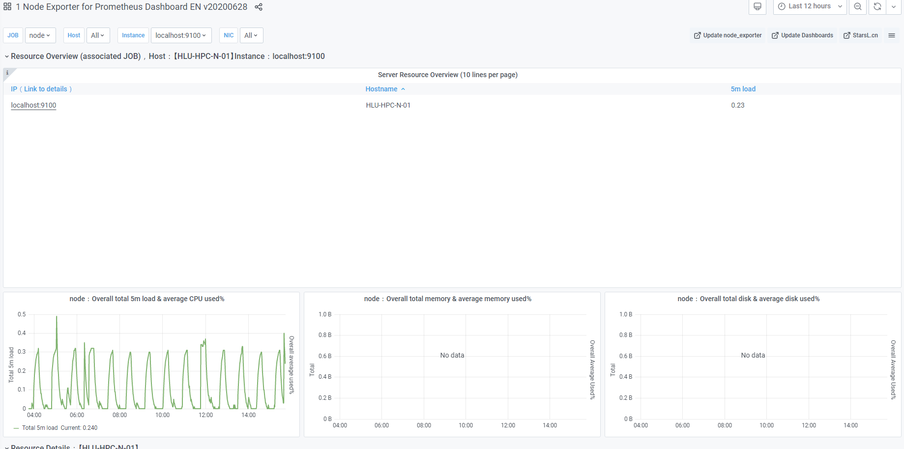

# hello world
## hello your world

# 제목1 
## 제목2
### 제목3
#### 제목4
**bold text**
*italic*
_italic_

> Blockquote(인용구)

# 순서가 있는 리스트
1. 사과
2. 배
3. 바나나
2. 사과

- 사과
- 배
- 바나나
- 사과

1. 사과
5. 배
    - 서울
    - 대구
9. 포도
10. 귤

this is my `first` commit // 하이라이트

---

horizontal line

---
## link
[my link](https://www.naver.com)




### Table
| Syntax | Description | test |
| ----------- | ----------| ----------|
| Header | Title | 01 |
| Para | Text |  02 | 
| apple | banana | 03 |

```c
#include <stdio.h>
int main(){
    int num1;
    printf("Enter : ");
    scanf("%d", &num1);

    printf("%d", num1);

    return 0;
}
```

```javascript
function func(){
    var a = 'AAA';
    return a;
}
```


```css
.list > li{
    position : absolute;
    top : 40px;
}
```

```bash
$ vim ./~zshrc
```

```python
s = "Python syntax highlight"
print s
```

```
No syntax :(
```

### Task List
 - [x] Write the pree release
 - [ ] update the website
 - [ ] contact the media


 # :-) 8-)
(c) (C)  <br>
~~Strikethrough~~

+ hello
    - hi

:wink:
:cry:

19^th^

# Footnotes
link[^first].

        {some code, part of Definiton2 }


*[HTML]: Hyper Text
*[example] : this is example

::: warning
this is warning
:::